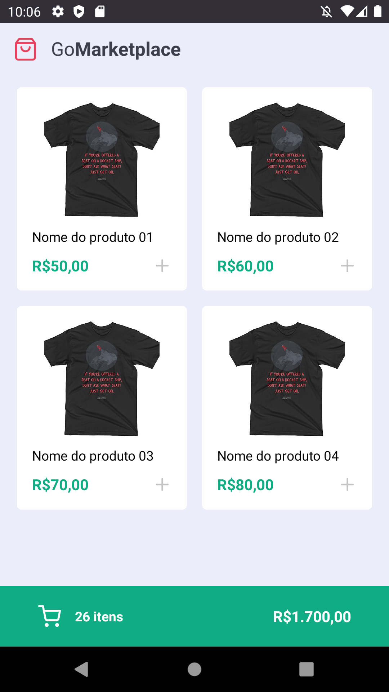
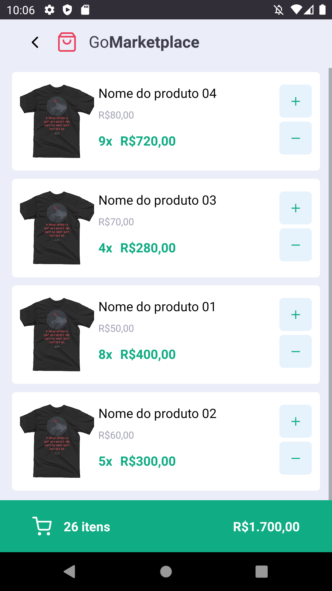

# Desafio 08: Fundamentos do React Native


### Sobre API
- Neste desafio, foi usado uma api fake para fornecer os dados para a aplicação.

## Sobre como executar o desafio
- Para executar, basta clonar o mesmo com o comando abaixo:

```bash
git clone git@github.com:andrelinos/gostack-fundamentos-react-native.git
```

- Após fazer o clone da pasta, basta executar o comando abaixo para baixar as dependencias do projeto com o comando baixo:

```bash
yarn
```

- Execite o json-server com o serguinte comando abaixo estando dentro da pasta do desafio:

```bash
yarn json-server server.json -p 3333
```
**Nota**: Após executar, basta minimizar a janela e continuar com os passos para a execução do projeto.

- Pronto, agora basta instalar a aplicação em seu dispositivo físico ou emulador com o comando a seguir:

```bash
yarn android
```
- Então após finalizar a compilação e instalação da aplicação em seu dispositivo, basta iniciá-la com o comando a seguir:

```zsh
yarn start
```
Pronto, agora você pode testar a aplicação no dipositivo

## Dicas
- Se na primeira execução a aplicação apenas der tela branca, basta fechar e abrir novamente o app no dispositivo.
- Se der erro tal como `Network error`, escolha uma das opções no arquivo `services/api.ts`.

## Tela inicial da aplicação


## Tela do carrinho


Feito com ♥ by Andrelino Silva :wave:
